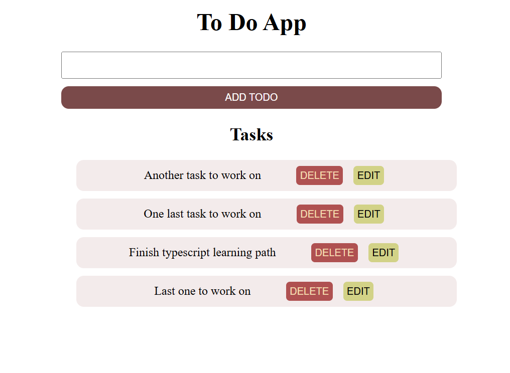
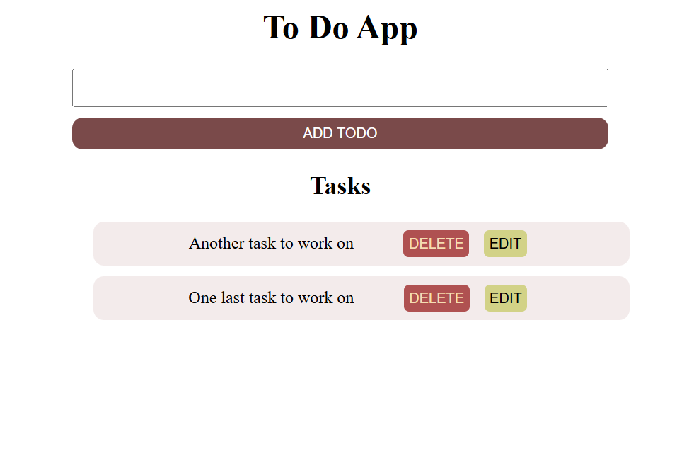
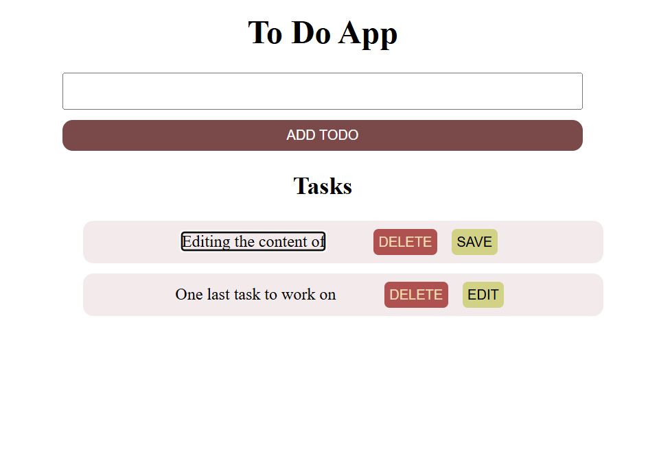

# Simple TypeScript To-Do App
An interactive To-Do list built using **TypeScript**, **HTML**, and `localStorage` for persistance.

users can
 ## Add new tasks
     - Type in the input field and click the "Add" button to create a task

 ## delete task
     - Click the DELETE button to remove the task from the list.

 ## Edit existing tasks
     - Click the "Edit" button to make a task editable
     -Button turns into SAVE, allowing you to store changes.

 ## Tasks Persist on Refresh
    - The tasks remain even after closing or refreshing the page, thanks to localStorage.

 

## how to run The App
 - clone this repository
      -git clone https://github.com/meronsisay/ToDo-app-ts.git
 -  install typescript => npm install -g typescript
 - Compile the TypeScript file =>tsc
 - open index.html